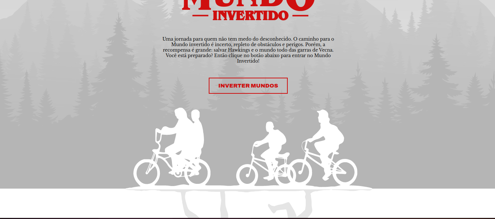

<h1 align="center"> Stranger Things</h1>

<p align="center">
  <a href="#-tecnologias">Tecnologias</a>&nbsp;&nbsp;&nbsp;|&nbsp;&nbsp;&nbsp;
  <a href="#-projeto">Projeto</a>&nbsp;&nbsp;&nbsp;|&nbsp;&nbsp;&nbsp;
  <a href="#-deploy">Deploy</a>&nbsp;&nbsp;&nbsp;|&nbsp;&nbsp;&nbsp;
  <a href="#memo-licença">Licença</a>
</p>

<p align="center">
  
</p>

<br>

<p align="center">
  
</p>

## 🚀 Tecnologias

Esse projeto foi desenvolvido com as seguintes tecnologias:

- Javascript
- HTML
- CSS

## Instalação do projeto


- Clone o repositório do GitHub:

```bash
git clone https://github.com/Rodrigo-Monteiro-Lima/quiz-react.git
```

Entre na pasta do projeto com o comando 

```javascript
cd Strange-Things
```

Abra o index.

## 💻 Projeto

É um projeto feito com base na série Stranger Things da Netflix, podendo realizar o cadastro para um grupo da série.


## 🔖 Deploy

Acesse esse site por: [Github Pages](https://https://rodrigo-monteiro-lima.github.io/Strange-Things/)


## :memo: Licença

Esse projeto está sob a licença MIT.

---
